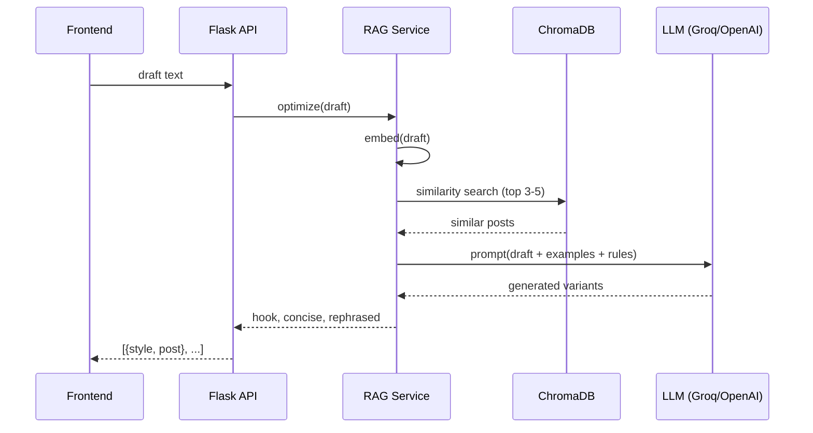
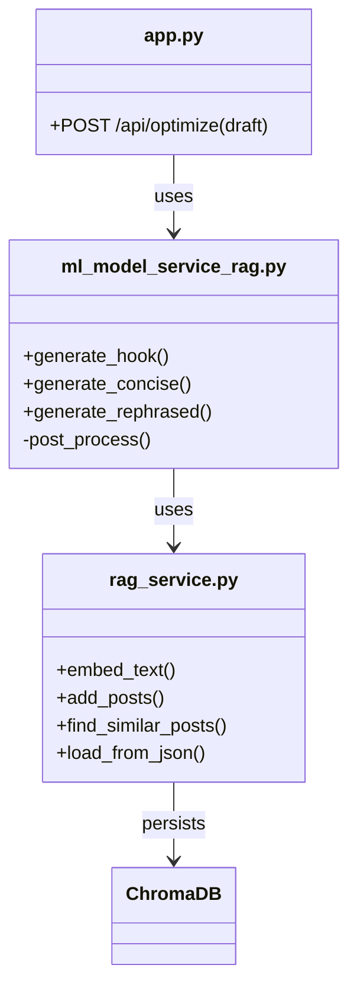

<div align="center">

</div>

# AI LinkedIn Post Optimizer (RAG + Llama 3.1)

A full-stack app that turns rough LinkedIn drafts into three high-quality versions using Retrieval-Augmented Generation (RAG):

- 🔥 Engagement Hook (attention-grabbing open + CTA)
- ✂️ Concise Version (sharp, punchy 50–80 words)
- ✨ Professional Rephrase (polished, influencer tone)

This project combines a React + Vite frontend, a Flask backend, a ChromaDB vector store, and a fast LLM (Groq Llama-3.1-8B by default) with sentence-transformer embeddings.

---

## 🚀 Highlights

- RAG with ChromaDB over 178 high-quality example posts
- Sentence embeddings via `all-MiniLM-L6-v2`
- LLM generation via Groq (FREE) or OpenAI (fallback)
- Post-processing for emoji/hashtag quality and engagement
- Clean REST API returning three suggestions in `{ style, post }`

---

## 🏗️ Architecture (Diagrams)

### System overview

```mermaid
flowchart LR
    A[React + Vite Frontend] -->|POST /api/optimize {draft}| B[Flask API]
    B --> C[RAG Service]
    C --> D[(ChromaDB)]
    C --> E[Embeddings: all-MiniLM-L6-v2]
    C --> F[LLM: Groq Llama-3.1-8B / OpenAI]
    F --> B --> A
```

### RAG flow (detailed)



### Backend components



---

## 🧠 Deep Learning & IR Concepts Covered

- Sentence embeddings (SBERT: `all-MiniLM-L6-v2`)
- Vector similarity search (cosine distance via ChromaDB)
- Prompt engineering with in-context examples (few-shot via retrieval)
- Post-processing heuristics (emoji limit, hashtag filtering, CTA)
- Transformers (T5 small used earlier for rephrase; remains available)
- CNN for text (legacy model retained for learning/reference)
- Tokenization, vocab handling, and sequence generation basics

See: `backend/models/`, `backend/vocabulary.py`, `backend/ml_model_service_rag.py` and `backend/rag_service.py`.

---

## � Tech Stack

- Frontend: React, TypeScript, Vite, Tailwind
- Backend: Flask, Python 3.11
- Vector DB: ChromaDB (persistent)
- Embeddings: sentence-transformers `all-MiniLM-L6-v2`
- LLM: Groq Llama-3.1 (8B by default) or OpenAI GPT-3.5

---

## 🖥️ Run Locally (Windows PowerShell)

### 0) Prereqs
- Node.js 18+
- Python 3.11 (using `C:/Users/adity/Downloads/VS_Code/python.exe` in this repo)

### 1) Install dependencies
```powershell
# From project root
npm install

# Backend deps
cd backend
pip install -r requirements.txt
```

### 2) One-time: Build / refresh the vector DB (optional)
```powershell
# Loads 178 posts into ChromaDB
C:/Users/adity/Downloads/VS_Code/python.exe rag_service.py
```

### 3) Set LLM key (Groq recommended: FREE)
```powershell
# In each new terminal session where you run the backend
$env:GROQ_API_KEY = "gsk_your-key-here"
```

### 4) Run servers
```powershell
# Terminal 1 – Backend
cd backend
C:/Users/adity/Downloads/VS_Code/python.exe app.py
```
```powershell
# Terminal 2 – Frontend (from project root)
cd ..
npm run dev
```

Open http://localhost:3000 (Vite) and start optimizing.

---

## 🔌 API

- POST `/api/optimize`
    - Request: `{ "draft": "your text..." }`
    - Response: `[{ style: "...", post: "..." }, ...]` (3 suggestions)

Implementation: `backend/app.py` calls `ml_model_service_rag.py`, which uses `rag_service.py`.

---

## �️ Project Structure (key files)

```
.
├── App.tsx
├── components/
├── services/apiService.ts
├── backend/
│   ├── app.py
│   ├── rag_service.py
│   ├── ml_model_service_rag.py
│   ├── data/full_dataset.json
│   ├── chroma_db/        # persisted vectors (ignored by git)
│   └── requirements.txt
├── README.md
└── ...
```

---

## 🧪 Quality Controls

- Max 2–3 emojis, contextual only
- 2–3 relevant hashtags (e.g., `#AIinSoftwareDev`, not `#SEO`)
- Engagement CTA at the end (question/prompt)
- Length constraints by variant (concise vs rephrase)

---

## 🐛 Troubleshooting

- Backend not starting: ensure `$env:GROQ_API_KEY` is set in the same terminal before `app.py`.
- Vector DB empty: run `python rag_service.py` once from `backend`.
- Port conflicts: check `netstat -ano | findstr 5001 3000 3001 5173`.
- Secrets in repo: never commit real API keys. Use env vars.

---

## � Further Reading

- `RAG_SETUP_GUIDE.md` – in-depth implementation notes
- `RAG_QUICK_START.md` – fast steps and comparisons
- `SUCCESS.md` – what’s working and example outputs

---

## � License

MIT (add a LICENSE file if you plan to open source usage).

---

## � Acknowledgments

- ChromaDB, sentence-transformers, Groq, OpenAI
- React, Vite, Tailwind, Flask
- Hugging Face ecosystem

**Happy shipping!** 🚀
